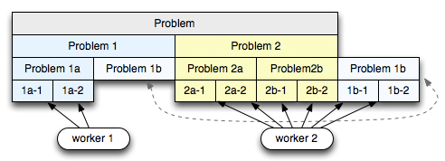

# Сети

####TCP/IP stack:


| Уровень       | Протоколы
------------------| ----------
| Application  |   http, ftp, smtp, ssh, telnet, DHCP, DNS
| Transport      |  tcp, udp; добавляет source, dest port
|  Internet / Network         |  IP, ICMP; добавлет source, dest IP
| Link      |  Протоколы:  Ethernet;  ARP, RARP

Link уровень уже не в tcp/ip. 

Шлюзы ранее были чисто хардварными и использовались для соединения нескольких различных сетей. Они работают на сетевом уровне.
Сетевые мосты отличаются от шлюзов тем, что они соединяют сети на канальном уровне. TCP/IP  интернет преимущественно использует не мосты, а шлюзы.

У шлюза имеется два или более сетевых интерфейса так как он соединяет две или более сети. Поэтому у шлюза не менее двух IP адресов. 

При открытии клиентом соединения ему выдается ОС какой-то порт (т.н. недолгоживущий порт) из числа свободных, обычно между 1024 и 5000. 

Loopback обрабатывается на сетевом уровне (заворачивается там после обработки, то есть посылается себе на вход IP пакет).

### IP протокол
IP - ненадежный протокол. В случае какого-то неуспеха при отправлении пакета, роутер, на котором все закончилось, шлет посылающему ICMP пакет. Также IP является не поддерживающим соединение в смысле, что каждый пакет отправляется независимо от других, поэтому в частности они могу приходить в произвольном порядке. 

max размер IP пакета 65535, но Ethernet имеет Maximum Transfer Unit 1500, поэтому столько и пересылается. У других сетей мб другой MTU, поэтому по ходу маршрутизации пакеты могут распиливаться и снова собираться.

IP заголовок содержит в себе в том числе
- id пакета (увеличивается на 1 с каждым отосланным пакетом)
- тип протокола транспортного уровня 
- TTL - число прыжков по роутерам допустимое
- длину IP пакета (так как короткие пакеты могут быть удлиннены до минимальной допустимой длины пртокола канального уровня) вместе с заголовком.
- checksum IP заголовка. Так как при прохождении роутера TTL уменьшается, роутер пересчитывает чексумму. 
- Естественно, пакет содержит IP отправителя и получателя. 

Существуют также опции, которые очень редко используются:
- опция, заставляющая роутеры ставить timestamp
- роутеры пишут свои IP при пересылке
- список единственно возможных / обязательных к посещению роутеров

#####Маршрутизация IP-пакетов
В общем случае, IP может получить для пересылки пакет от TCP, UDP, ICMP, IGMP (то есть локально сгенерированный пакет), либо пакет от сетевого интерфейса - для пересылки. 

Когда пакет поступает от сетевого интерфейса, первым делом проверяется, не является ли IP адрес получателя нашим адресом или броадкастом. Если да, то пакет передается наверх соответствующему записанному значению протоколу. Иначе, если IP уровень сконфигурирован как хост, то он молча выбрасывает пакет, иначе перенаправляет его (если он роутер). 

Для отправки пакета используется таблица маршрутизации в памяти, содержащая следующее:
- ID сети: может быть либо адресом хоста, либо адресом вcей сети; это ID сети, соответствующей пути, описываемому данным вхождением таблицы.
- Маска сети - позволяет по входу = IP адресата понять, подходит ли данный ID сети для отправки
- IP следующего роутера для передачи сообщения, то есть IP адрес роутера непосредственно связанной сети
- Метрика - чаще всего, число прыжков, которые надо сделать, чтобы дойти до сети описываемой ID
- Инфо о том, какому сетевому интерфейсу пакет должен быть передан для пересылки

Алгоритм маршрутизации: 
1. Считаем битовые AND с масками всех вхождений сети. Если результат совпадает с ID соответствующей строчке, это кандидат.  Берем для прыжка вход с ID: результат AND совпал с ID и максимальная маска у этого ID. Если таких несколько, берем с минимальной метрикой.
2. Иначе ищем в таблице вхождение с меткой default (но это будет автоматом, так как у него ID = MASK = 0.0.0.0).

Если ни один из шагов не сработал, destination host unreachable ошибка. 

При пересылке destination IP не меняется, а вот destination адрес на канальном уровне это каждый раз новый адрес - адрес следующего роутера. 

Адрес IP состоит из адреса сети (сеть может быть класса A, B и С), адреса подсети, и адреса хоста в подсети. 
Класс B имеет первые 2 байта на адрес сети, остальные могут быть произвольно распределены между адресом хоста и подсети. Использование подсетей позволяет сделать адресацию хостов всей описываемой сети прозрачной длявнешних роутеров: у них будет всего одно вхождение в таблицу марщрутизации для доступа к роутеру, соединяющему всю сеть с Интернетом. В то же время, роутеры внутри сети уже знают о существовании подсетей и потому маршрутизируют пакеты оответственно. Зная маску подсети и свой IP адрес, хост может определить, явлется ли произвольный пакет предназначенным ему, хосту в его подсети, хосту его сети, но другой подсети, или вообще хосту другой сети. Это можно сделать, так как определить класс сети (А, B или С) можно, посмотрев на старшие три бита первого байта IP адреса. 

###TCP
TCP протокол базируется на IP для доставки пакетов, но добавляет две важные вещи:
- установление соединения — это позволяет ему, в отличие от IP, гарантировать доставку пакетов
- порты — для обмена пакетами между приложениями, а не просто узлами

Протокол TCP предназначен для обмена данными — это «надежный» протокол, потому что:

1. Обеспечивает надежную доставку данных, так как предусматривает установления логического соединения;
2. Нумерует пакеты и подтверждает их прием квитанцией, а в случае потери организует повторную передачу;
3. Делит передаваемый поток байтов на части — сегменты - и передает их нижнему уровню, на приемной стороне снова собирает их в непрерывный поток байтов.

Установление соединения: пусть узел А хоче установить TCP соединение с узлом B. Происходит следующее:
1. A -> B шлет спец пакет SYN
2. B -> A шлет спец пакет SYN-ACK
3. A -> B шлет спец пакет ACK

Когда кто-то хочет порвать соединение, он шлет спец пакет FIN.

### UDP 
Похож на TCP, но он не устанавливает соединения и не требует подтверждения доставки. Поэтому пакеты могут теряться и приходить в неправильном порядке. 

### ARP

ARP используют для узнавания MAC адресов (вернее, в общем случае вдресов канального уровня)  по IP, RARP наоборот. Он шлёт броадкаст всем интерфейсам данной сети (броадкаст адрес в случае MAC это 0xff:ff:ff:ff:ff:ff). Узел, имеющий IP равный тому, про кторый спрашивает ARP запрос, отвечает ARP-ответ, содержащий свой адрес канального уровня. Ответ уже естественно не броадкаст а только тому, кто спрашивал. При этом обычно MAC спрашивающего перед этим кешируется, так как скорее всего ему потом надо будет отвечать, а значит все равно придется узнавать MAC. 
Пока датаграмма передается по интернету, MAC адрес получателя не важен, важны только MAC следующего интерфейса для прыжка. Но когда пакет достигает сети полчателя (последнего роутера), роутеру уже надо знать MAC получателя. 
При любом прыжке в принципе роутер мог бы каждый раз опрашивать броадкастным ARP о мак-адресах, но он обычно хранит кеш, содержащий недавние IP и их маки.

### RARP
RARP практически не используется так как он нужен для узнавания своего IP, но для этого сейчас DHCP.
Использовался бездисковыми системами в момент бутстрапа. RARP запрос является бродкастным, а ответ естественно уникастный (если RARP сервер работает, иначе ответа не будет). 

### ICMP
Internet Controll Message Protocol работает в связке с IP. По типу делятся на сообщения об ошибках и запросы. Когда шлется ICMP сообщение об ошибке, оно содержит заголовок и первые 8 байт IP пакета, вызвавшего ошибку. Это позволяет определить использованный этим сообщением протокол (TCP/UDP) и пользовательское приложение (так как TCP/UDP порт также содержится в первых 8 байтах). 

При этом, ICMP сообщение об ошибке никогда не генерируется в ответ на:
- ICMP сообщение об ошибке (на ICMP запрос тем не менее это правило не распространяется)
- IP пакет, адресат которого броадкаст/мультикаст
- пакет, посланный броадкастом на кнальном уровне
- любой фрагмент кроме первого
- пакет, адрес которого не может быть адресом одного хоста

Используется в случае:
- Проверки достижимости хоста (ping)
- Роутер возвращает сообщение с причиной, по которой посланное ранее сообщение не доставлено
- Сообщение о снижении скорости в связи с перегрузкой роутера запросами
- Предложение о смене пути доставки сообщения - работает только в локальных сетях в случае, когда роутер узнает о существовании более оптимального пути
- Сообщение о том, что отправленное сообщение достигло TTL (числа прыжков по роутерам в данном случае)
- Запрос внутреннего времени узла - конечно, погрешность от передачи по сети, но все же
- Запрос маски подсети. Аналогично RARP, используется при бутстрапинге бездисковой системы. 


### DNS
Domain Name System позволяет использовать текстовые имена вместо IP
Спрашивает у DNS сервера о том, как преобразовать текст в IP
Если DNS сервер не знает о запрошенном у него имени, он перешлет запрос вышестоящему серверу (как я понимаю, сразу же корневому серверу)
Существует DNS TTL - период, с которым DNS сервер переспрашивает об известных ему маппингах имен у вышестоящего сервера - на случай, если поменялось что. От нескольких часов до нескольких дней
В качестве транспорта использует UDP
Позволяет серверу выдавать разные результаты для одного и того же IP по разным именам, присваивая одному IP несколько имён.

Пространтсов DNS имен иерархично. Домены верхних уровней - com, ru, org и тп, управляются NIC. Зона DNS - это поддерево DNS дерева, управляющаяся отдельно. Обычно зоны - домены второго уровня, которые в свою очередь тоже могут быть разбиты на зоны. В каждой зоне имеется основной и вспомогоательный именные сервера (для отказоустойчивости). Основной именной сервер хранит данные об именах и IP в конфигурационном файле, который может правиться администратором. Вспомогательные сервера регулярно запрашивают у него эту информацию. 
Если основной именной сервер не знает как ответить на запрос, он шлет его корневому DNS серверу. Корневые сервера знают адреса всех DNS серверов верхнего уровня, и дальше мб уже у такого сервера уточняем. 

#### Записи DNS
Записи DNS, или ресурсные записи (RR) - то что передается и хранится DNS. RR содержит поля:
- NAME доменное имя, которому принадлежит запись
- TYPE - тип записи (A, AAAA, NS, PTR..)
A - адресная запись - то есть IPv4;
AAAA- IPv6
NS - указывает DNS сервер для данного домена
PTR - связывает IP адрес с его доменным именем. 
- TTL - время хранения записи в кеше неосновного для данного доменного имени сервера
- DATA - данные, зависящие от типа записи

#####Записи типа PTR
DNS может решать и обратную задачу - по IP вернуть имя узла. Для решения этой задачи завели специальный домен in-addr.arpa., в котором каждому IP с зарегистрированным именем соответствует доменное имя, в котором IP идет в обратном порядке (чтобы можно было читать с корня вниз). 

##### Рекурсия в DNS
Термином Рекурсия в DNS обозначают алгоритм поведения DNS-сервера, при котором сервер выполняет от имени клиента полный поиск нужной информации во всей системе DNS, при необходимости обращаясь к другим DNS-серверам. Соответственно запрос может быть рекурсивным и нерекурсивным, смотря чего хочет запрашивающий. 

Ответ на рекурсивный запрос - либо то, что хотел запрашивающий, либо пустой ответ с кодом ошибки.

Ответ на нерекурсивный запрос - это либо то, что хотел клиент (например, IP по имени), либо, если DNS сервер, у которого спрашивали, не знает ответ, он сообщает, кто из ему подчиненных DNS серверов (в его зоне) может знать ответ. При этом ссылок на верхние DNS сервера ответ не содержит никогда. 


TCP - чекает, что пакеты дошли; борется с реордерингом
UDP - не делает этих двух вещей

Маршрутизация пакетов происходит на Network уровне.

###Порты и NAT

NAT = Network Address Translation
Может осуществляться почти любым маршрутизирующим устройством. Наиболее популярен SNAT - замена адреса источника при отсылке IP пакета и обратной замене адресата при получении. Также могут заменятьсяя порты. 

Позволяет всей локальной сетке использовать один публичный IP: для общения со внешним интернетом, например, надо, чтобы можно было достучаться до отправляющего запрос, поэтому роутер меняет IP посылающего (локальный) на свой (внешний) и также меняет порт, чтобы потом понять, какому приложению слать ответ в случае, если он будет получен. Информация о соответствии подмененных портов адресатам хранится во временной таблице. 

Также часто используется DNAT (destination), когда обращения извне транслируются межсетевым экраном на компьютер пользователя в локальной сети, имеющий внутренний адрес и потому недоступный извне сети непосредственно (без NAT).

Три основных подхода в NAT:
- статический NAT - отображение незарегистрированных и зарегистрированных IP 1:1
- динамический NAT - отображение незарегистрированного IP в один из группы зарегистрированных (смотря какой свободен на момент коммуникации)
- Перегруженный NAT (PAT - port address translation) - вид динамического NAT, когда группа незарегистрированных IP отображается в один зарегистрированный, используя разные порты. 

## Различные протоколы
DHCP = Dynamic Host Configuration Protocol
протокол для определния своего IP. Используется для общения с сервером провайдера (DHCP сервером) или роутера (роутер тоже раздает адреса). Кроме собственно присовоения IP, DHCP сервер выдает адрес DNS сервера, адрес default gateway - маршрутизатора (нужен если не получается найти в своей сети, то шлем туда) и маску подсети. Использует UDP как транспорт


---------------------------------------------------------
Маршрутизация мб статической и динамеской, в интернете всегда динамическая, то есть маршрут может меняться по ходу дела. Для синхронизации таблиц маршрутов между роутерами используются протоколы маршрутизации.
Наиболее известные: BGP (Border Gateway Protocol), RIP (Routing Information Protocol), OSPF (Open Shortest Path First) 

RIP: каждые 30 секунд всем известным роутерам рассылается таблицы маршрутизации свои. Таблицы маррутизации содержат все сети, до которых роутер умеет дойти и число прыжков, которое для этого надо сделать
При получении RIP сообщения роутер может перестроить свои маршруты. Проблема мб в том что кратчайший по прыжкам путь не всегда самый эффективный. Также не проверяется доступен ли вообще путь и насколько загружен.
Использует UDP в качестве транспорта

OSPF несмотря на название ищет не кратчайшийпо прыжкам, а быстрейший путь. Идея в том что периодически шлется тестовое hello сообщение известным сетям и проверяется время отклика. Роутеры, использующие OSPF знаю не только о кратчайшем путе, но и о других путях => могут балансировать нагрузку.

BGP - для больших сетей - внешний протокол маршрутизации, в то время как предыдущие два для внутренней. Когда BGP бегает внутри сети одного администратора (например, провайдера), это IBGP, иначе EBGP. Узлы, администрируемые одним владельцем называются автономной системой. BGP намного сложнее OSPF и RIP. В отличие от RIP, шлют только обновления в своих таблицах маршрутизации. Также периодически проверяет достижимость узлов. Использует TCP как транспорт.


## 1. Java OOP. Classes, Interfaces, Enums, Abstract classes. Java 8 OOP features.

#### Classes
Блоки инициализации выполняются в порядке их объявления в классе.

- Статические (static initializer): 
```java
class Whatever {
	static int x;

	static {
		x = 10;
	}
}
```
Исполняются в порядке появления в момент загрузки класса класслоадером. 

- Обычные блоки инициализации (instance initializer) - копируются в начало тела каждого конструктора
```java
class Whatever {
	int x;
	{
	    x = 10;
	}
}
```
Они исполняются ПОСЛЕ конструктора предка ПЕРЕД собственным конструктором.

Внутренние классы - объявлены внутри класса. 
Локальные классы - объявлены внутри метода. 
Анонимные классы - локальные классы без имени.

Локальные классы имеют доступ к членам класса, который их содержит, а также к локальным переменным, видимым в блоке, где они объявлены. Однако, эти локальные переменные должны быть `final`. 
Локальные и внутренние классы не могут иметь `static` членов, кроме `final` полей примитивных типов и строк, а также сами не могут быть объявлены static. Так как интерфейсы неявно объявляются static, они не могут быть локальными. 

Определение анонимного класса: 
```java
Foo x = new Foo() { // после new либо имя реализуемого интерфейса, либо имя расширяемого класса
...
}; // так как определение анонимного класса это выражение, то нужна ;

```
У анонимного класса нельзя определять конструкторы, но можно заводить блоки инициализации. 

#### Enums
Перечисления определяют enum type, на самом деле класс. Тело этого класса может содержать методы и поля. Также компилятор атвоматически добавляет некоторые методы, например статический `values`, возвращающий массив всех значений енума. Все перечисления неявно наследуются от `java/lang.Enum`, поэтому их нельзя ни от чего ещё отнаследовать. Конструктор enum должен быть приватным или с пакетной видимостью, и его нельзя явно вызывать. 

- Functional interface - с единственным абстрактным методом; может быть реализован лямбдой
- Method References - иногда едиенственная задача лфмбды - делегировать исполнение какому-то методу. Для этого сделали шорткат - ссылки на методы. Могут быть: 
    - на статические методы: ```String::format```
    - метод заданного объекта
    - конструкторы: ```String::new```
    - метод произвольного объекта заданного типа: ```String::compareToIgnoreCase``` <=> ```(a, b) -> a.compareToIgnoreCase(b)```
- Streams

#### Interfaces
Начиная с java 8, можно иметь статические методы, определённые в интерфейсах, а также дефолтные реализации.
NB дефолтные реализации нельзя делать для toString, hashCode, equals

## 2. Java Thread. Synchronized, wait, notify, notifyAll. Volatile

С пользовательской точки зрения java программа всегда начинается с одним тредом. На самом деле под капотом ещё есть потоки, реагирующие на сигналы ОС, управляют памятью, но это не суть.

Свойства потока (name, id, priority, daemon) не могут изменяться после старта. 

Состояние потока можно узнать с помощью getState() и isAlive()

| getState()       | isAlive() | Описание
------------------| ----------    | -------
| NEW  |   false | После создания экземлпяра Thread до вызова start()
| RUNNABLE      |  true | После вызова метода start(); поток в этом состоянии если он исполняется в JVM или ждет процессорного времени и не заблочен
|  BLOCKED        |  true | Поток ожидает на каком-то мониторе (вызвал synchronized участок кода и пока не захватил монитор)
| WAITING      |  true | Поток вызвал wait/join/LockSupport.park
|  TIMED WAITING        | true | Те же варианты что в WAIT, но с ограничением по времени
| TERMINATED      |  false | Поток завершил исполнение

Зеленые потоки - потоки, реализованные в JVM и скедулящиеся без поддержки со стороны ОС. Скедулер не очень честный потому что всегда выбирает потоки с наибольшим возможным приоритетом, которые не заблокированы и не ждут. Если низкоприоритетный поток захватил блокировку, которая нужна высокоприоритетному потоку и он заблокировался из-за этого, получаем инверсию приоритетов. JVM борется с инверсией приоритетов путем временного повышения приоритета потока, имеющего лок до приоритета заблокированного потока. 

`yield` позволяет скедулеры снять поток с исполнения и заменить потоком с приоритетом, не меньшим, чем у вызвавшего `yield`.


Happens-before:
- В одном и том же потоке - последовательные команды ествественно связаны happens-before
- unlock монитора и захват *того же монитора*
- чтения и записи в vlatile переменную
- Все что до thread.start() и то что внутри thread.run()
- Все изменения в потоке, которого ждем `join()` будут видны после завершения `join()`


* `synchronized` - захватывает монитор, связанный с объектом
Конструкторы не могут быть synchronized, так как не нужно. Мониторы реентерабельны: можно захватывать повторно тем же потоком. 
* `wait` - освобождает монитор и переводит вызвавший поток в режим ожидания вызова ```notify``` (не в режим ожидания монитора!)
* `notify` будит 1 поток, вызвавший ранее `wait`
* `notifyAll` будит всех, вызвавших `wait`
Последние три метода работают только с захваченным монитором!
`notify*` НЕ отпускают монитор! То есть разбуженные потоки сразу же переходят в режим ожидания на мониторе.

NB вызовы yield/sleep/join не освобождают захваченные блокировки


`volatile`: всегда пишется в основную память а не в кеш; happens-before: всё, что случилось до записи/чтения `volatile` в одном потоке будет видно после записи/чтения volatile в другом потоке, если оно случилось позднее. Запрещён реордеринг инструкций c `volatile`

Когда `volatile` недостаточно - например, когда надо прочесть, а затем используя прочитанное, как-то обновить её. Если это делается в нескольких потоках, мб гонка. 

Операции чтения и записи над всеми типами, кроме long и double атомарны. Операции read/write над всеми `volatile` переменными атомарны. 


## 3. Java.util.concurrent. Future. ExecutorService

Future - результат асинхронного вычисления. Имеет методы `get([time])`, `cancel(mayInterruptIfRunning)`, `isDone()`.
Отмена возможна, только если задача ещё не выполнена. При этом, если она выполняется уже, то она отменится только в случае вызова `cancel(true)`. Де-факто cancel с уже запущенной таской просто делает interrupt исполняющего потока, поэтому если таска не реагирует на прерывания, она все равно будет жрать процессорное время пока не закончится, несмотря на то, что уже отменена. 

ExecutorService - an Executor that provides methods to manage termination and methods that can produce a Future for tracking progress of one or more asynchronous tasks.

Все действия в потоке, сабмитящем задачу в Executor happens-before старта исполнения задачи в этом экзекьюторе
`ExecutorService`: интерфейс со следющими методами

* `Future<?> submit(Runnable)` -  get вернёт `null` в случае успеха 
* `Future<V> submit(Callable<V>)`
* `List<Future<V>> invokeAll(Collection<? extends Callable<V>>` - запускате коллекцию задач на выполнение и *ждёт* пока все они не выполнятся! То есть по возвращении из метода все future вернут по `isDone()` true.
* `V invokeAny(Collection<? extends Callable<V>>` - начинает выполнять все что в коллекции, и возвращает что-то, что выполнилось. остальные при этом отменяются. 

Завершение работы: 

* `void shutdown()` - прекратить приём новых задач, но уже запущенные задачи продолжают исполняться
* `boolean awaitTermination(timeout)` - блокируется с ожиданием завершени всех бегущих задач в экзекьюторе. Следует вызывать после `shutdown()`, вовзвращает true, если все задачи выполнились, а не закончился timeout. 
* `List<Runnable> shutDownNow()` - полный стоп. Интераптит потоки, исполняющиеся сейчас, не принимает больше задач. Понятно, что если задача не реагирует на интерапт, она все равно продолжит испоняться. Возвращает список еще не запущенных тасок. 
* `isShutdown()` - понятно
* `isTerminated()` - если был вызван уже shutdown* какой-то и все таски закончили исполнение. 

Так как все потоки, используемые в ExecutorService, обычно не демоны, то если не сделать shutDown, можем ждать завершения до ишачьей свадьбы. 

Создание ExecutorService:
Можно создавать например используя явно конутруктор `ThreadPoolExecutor`, но там много настроек. 
Можно использовать статические фабрики класса `Executors`:

* `newCachedThreadPool()` - создает потоки по необходимости, созданные потоки живут при несипользовании 60 секунд
* `newFixedThreadPool(n)` - c n потоками и общей неограниченной очередью задач. Если какой-то умрет в ходе выполнения задачи, будет создан новый когда надо будет еще что-то сделать и потоков не будет хватать. Потоки живут пока не вызван явно shutDown.
* `newSingleThreadExecutor()` - с единственным потоком и неограниченной очередью задач. Если выбросится исключение какой-то таской и еще не shutdown, то все не умрет, а создастся новый поток для продолжения исполнения. Задачи выполняются по порядку поступления. 

Отклонение заданий - если нет свободного потока и места в очереди. В этом случае вызывается RejectedExecutionHandler. Существует набор уже определенных:

* AbortPolicy – бросить RejectedExecutionException
* CallerRunsPolicy – исполнить в вызывающем потоке
* DiscardPolicy – проигноировать
* DiscardOldestPolicy – заменить самое давнее

Для отложенного исполнения существует интерфейс `ScheduledExecutorService` и его реализация `ScheduledThreadPoolExecutor`. Может выполнять задачи периодчиески. 

## 4. Java.util.concurrent. Примитивы синхронизации
#### Семафор
Может быть честным или нет (в первом случае дейтсвуте FIFO)
Хранит число разрешений на вход. Операции:

* `acuire` - блокируется, пока нет разрешений свободных или не прерван
* `release`
* `drainPermits` - захватить все мгновенно доступные разрешения

#### Барьер
По достижении барьера потоки блокируются, пока необходимое количество потоков не достигет барьера. 

`CyclicBarrier(n, runnable)` - число потоков и действие на барьере, которое выполнит ТОЛЬКО последний дошедший до него поток. Имеет методы:

* `await(time)` - ждет на барьере. Если произошел exception у кого-то из ожидающих (время или прерывание), то барер становится сломанным и кидается всем ждущим BrokenBarrierException. Последний пришедший к барьеру поток сначала исполняет действие на барьере и только затем будит остальные потоки. 
* `isBroken()`
* `reset()` 

#### Защёлка
Смысл - ожидание заврешения нескольких работ. Создаётся `new CountdownLatch(n)`
Методы :

* `await(time)` - понятно
* `cuntDown()`
* `getCount()` - сколько ещё осталось до спуска

#### Меняла
Позволяет обмениваться объектами двум потокам
По сути единственный метод `V exhcange(V obj, [time])`: если два потока вызвали его каждый со своим объектом, произойдет обмен,  результате вернёт то что, отдал другой поток. Реагирует на прерывания. 

Lock - интерфейс с более обширным набором операций, чем то, то дает монитор. Чаще всего предоставляет эксклюзивный доступ, но не всегда: например, лок на тение в ReadWriteLock
Локи более гибкие еще и потому, что захватить можно в одном месте, а освободить в другом.

tryLock - неблокирующая попытка захвата (мб с таймаутом)
lockInterruptibly - лок: 

* если он доступен и вызвавший поток не прерван, то попытка его завхватить сразу возвращается с успехом
* если вызвавший поток уже прерван, кидается InterruptedException
* Иначе ждет. если вызывающий поток прерывается в момент ожидания лока, тоже эксепшн.

Успешный лок/анлок имеет те же happens-before что аналогичные операции с монитором

методы типа synchronized на локах никак не связаны с их лочащами свойствами

`Condition` - интерфейс для подачи/ожидани сигналов. 
await([time]) - ждать условия
awaitUntil(deadline) - ждать до момента наступления deadline
awaitUninterruptibly - ждать условия
signal - пробудить 1
signalAll - пробудить всех

Когда await, поток не скедулится

По смыслу, локи + кондишны это разделение семантики мониторов на две части. Часть с synchronized это локи, часть с wait/notify/notifyAll это кондишны. 
Кондишны сами по себе не существуют, они обязательно принадлежат какому-то локу, и собственно создаются локами. Ключевой момент, что как и в случае с монитором, await() атомарно освобождает соответствующий лок. Поэтому await *обычно* вызывается когда захвачен лок, иначе скорее всего кинется эксепшн. Но зависит от лока. 
Когда await возвращается, гарантируется, что он владеет локом. 

`ReentrantLock`- возвращается сразу же, если уже захвачен этим же потоком.
В конструктор можно передать boolean fairness - если true, то в случае конкуренции дается доступ наиболее долго ждущему. 

`ReadWriteLock` - интерфейс, имеет методы `readLock`, `writeLock`. Имеется реализация ReentrantReadWriteLock. 

## 6. Functional Interfaces. Java 8 lambda

## 7. Optional<T>. Java 8 comparators.
####Optional

* `Optional<T> Optional.of(T x)` - кинет исключение, если `x == null`
* `Optional<T> Optional.ofNullable(T x)`
* `Optional.empty()`
* `T get()` -  кинет исключение, если пустой
* `T orElse(T other) / orElseGet(Supplier<? extends T> s)` - ...
* `void ifPresent(Consumer<? super T> consumer)` - вызовет потребителя если не пустой
* `Optional<U> map(Function<? super T,? extends U> mapper)` - применяет функцию если не пусто
* `Optional<U> flatMap(Function<? super T,Optional<U>> mapper)` - ну понятно
* `filter(Predicate<? super T> p)` - возвращает не empty если был не empty и фильтр успешен

####Comparator
Функциональнй интерфейс `Comparator<T>` - для сравнения объектов типа `T`. Желательно, чтобы порядок был согласован с равенством (equals). Круче Comparable, так как позволяет сравнивать null. 

Статические методы: 

* `static <T,U extends Comparable<? super U>> Comparator<T> Comparator.comparing(Function<? super T,? extends U> keyExtractor)` - Передаваемая функция вычисляет по объекту типа `T` Comparable сущность и она уже используется для сравнения созданным компаратором. 
* `static <T,U> Comparator<T> comparing(Function<? super T,? extends U> keyExtractor, Comparator<? super U> keyComparator)` - передаваемая функция уже не обязана генерить Comparable, но зато нужен свой компаратор ля сравнения ключей. 
* `static <T extends Comparable<? super T>> Comparator<T> naturalOrder()` - использует то, что сравниваемые обхекты сами Comparable
* `static <T> Comparator<T> nullsLast(Comparator<? super T> comparator)` - считает, что null больше любого не null. Если переданный компаратор не null, то он используется для сравнения когда оба сравниваемых объекта не null. 
* `default Comparator<T> thenComparing(Comparator<? super T> other)` - типа берем свой компаратор, вызываем у него это, и получаем новый компаратор, сравнивающий лексикографически, сначала нашим старым компаратором, потом тем, что передали

Есть отдельно для примитивных типов фабрики (comparingInt)... 
У строк есть компараторы встроенные: `String.CASE_INSENSITIVE_ORDER`

## 8. Java Streams. Типы операций. Стандартные операции. Reduce

Создание потоков: из коллекций, из файлов, случайные потоки, генераторы. 

* `static <T> Stream<T> generate(Supplier<T> s)` - создает бесконеный поток, берет каждое новое значение из s.
* `static <T> Stream<T> iterate(T seed, UnaryOperator<T> f)` - создает бесконечный поток, состоящий из seed, f(seed), ....
* `Stream s = Stream.builder().add("a1").add("a2").add("a3").build()`
* `Stream<String> streamFromValues = Stream.of("a1", "a2", "a3");` - создание из значений
* `Stream<String> streamFromFiles = Files.lines(Paths.get("file.txt"))` - создание из файла; каждая строка - новый элемент

Операции над потоками могут быть: 

* Промежуточные (конвейерные) - порождают поток и ленивые
	* `peek(Consumer<? super T>)` применяет функцию к элементу и кладет его обратно
	* `IntStream mapToInt(ToIntFunction<? super T> mapper)` - ну понятно, специализации для примитивных типов
	* `flatMap`, `flatMapToInt`, ... – создает из каждого элемента потока новые потоки по некому правилу и объединяет получившиеся потоки в один
* терминальные - энергичные, порождают значения
	* `max(Comparator<? super T>)`, `sum`, `average`, `boolean anyMatch(predicate)`, `findFirst`, `findAny`
	* `T reduce(T identity, BinaryOperator<T> accumulator)` - accumulator желательно иметь ассоциативным (важно в случае параллельного исполнения) и чтобы identity было нейтральным элементом. 

По типу того, как обрабатывают элементы:

* Без состояния - обработка элемента не зависит от других элементов
	* Например, map, filter
* С состоянием - обработка зависит от других элементов
	* max, distinct, sorted
* Обрывающие поток
	* limit

На параллельное исполнение накладываются ограничения:

* нельзя менять обрабатываемые данные
* нельзя сохранять данные между вызовами 
* нельзя иметь побочные эффекты, влияющие на контекст
* Результаты упорядочены [часто, но не всегда!!!], но не вызовы

для паралельного исполнени стрима, либо берем `Collection.parallelStream()`, либо от последовательного стрима можно взять `.parallel()`. Фишка в том, что по дефолту используется один и тот же ForkJoinPool для исполнения всех параллельных стримов, что не очень хорошо. Но можно установить свой пул так:


Ещё немножко про параллельность. В принципе, существует два подхода к параллелизации исполнения операций потока. Оба подхода, конечно, требуют использования parallelStream, но

1. Используем обычные коллекторы и получаем обычные коллекции - в этом случае, параллельность засчет того, что создается несколько инстансов коллекции, и потом они сливаются. Это вообще говоря может проседать по проивзоидительности так как например сливание map - это может быть недёшево.

2. Используем concurrent коллекторы (Collector.Characteristics.CONCURRENT) и либо unordered() вызываем на потоке, либо коллектор должен быть  Collector.Characteristics.UNORDERED. В этом случае используются Concurrent коллекции и это мб эффективнее.

Кстати, это работает не только с коллектом, но и другими терминальными операциями. Все они либо сохраняют порядок, либо нет. В частности, forEach не сохраняет порядок, а вот forEachOrdered сохраняет. 


## 9. Java Streams. Collectors. Собственная реализация.
Разница между reduce и collect: 

* reduce() работает с неизменяемыми результирующими значениями
* collect() может работать с изменяющимися результирующими объектами, и собственно для этого он и используется - изменяет переданный в него контейнер

`R collect(Supplier<R> supplier, BiConsumer<R,? super T> accumulator, BiConsumer<R,R> combiner)`
supplier производит новые инстансы коллекции
accumulator добавляет элемент стрима в коллекцию
combiner комбинирует две коллекции  (нужно только в случае параллельного исполнения)

`R collect(Collector<? super T,A,R> collector)`

Перейдем к собственно коллекторам. Для чего они нужны? Они инкапсулируют логику mutable reduce. Коллектор определяется четырьмя функциями: 

* создание нового результирующего контейнера (supplier())
* добавление данных в контейнер (accumulator())
* комбинирование двух результирующих контйнеров в один (combiner())
* опциональная конечная трансорфмация результирующего контейнера (finisher())

Также у коллектора есть набора хараектристик (например, `Collector.Characteristics.CONCURRENT`), которые подсказывают исполнителю как их эффективнее использовать. 

Собственно, создание своего коллектора: 

```java
static <T,A,R> Collector<T,A,R> of(Supplier<A> supplier, BiConsumer<A,T> accumulator, BinaryOperator<A>combiner, 
	Function<A,R> finisher, Collector.Characteristics... characteristics)
```

Есть перегрузка без `finisher`.

## 10. Java Streams. Collectors. Стандартные реализации.

Находятся в классе `Collectors`.
Примеры: 

* `Collector<T,?,List<T>> toList()` - любимый
* `counting()` - считает число элементов стрима
* `Collector<T,?,Map<K,List<T>>> groupingBy(Function<? super T,? extends K> classifier)` - производит как результат мапу, отображающую ключи типа K, вычисляемые classifier, в элементы стрима типа T: на выходе `Map<K, List<T>>`. Это не concurrent коллектор, если нужен concurrent, используем `groupingByConcurrent`. 
* `Collector<T,?,Map<K,D>> groupingBy(Function<? super T,? extends K> classifier, Collector<? super T,A,D> downstream)` - более общий случай предыдущего варианта. Собирает элементы, отобразивашиеся в один ключ, используя downstream коллектор, передаваемый вторым аргументом. 
* `Collector<T,?,Double> averagingInt(ToIntFunction<? super T> mapper)` - понятно, есть аналоги для double и long
* `Collector<CharSequence,?,String> joining([delimiter], [prefix, suffix])` - для склеивания строк
* `Collector<T,?,IntSummaryStatistics> summarizingInt(ToIntFunction<? super T> mapper)` - для создания IntSummaryStatistics, которая умеет по скормленным её интами выдавать разные статы: min/max/sum/average
* `Collector<T,?,Map<K,U>> toMap(Function<? super T,? extends K> keyMapper, Function<? super T,? extends U> valueMapper)` - понятно; если несколько элементов отображаются в один ключ, это фейл и будет эксепшен (`IllegalStateException`). 
*  В случае, когда надо работать с повторяющимися ключами: 
```java
Collector<T,?,Map<K,U>> toMap(Function<? super T,? extends K> keyMapper,
                                                    Function<? super T,? extends U> valueMapper,
                                                    BinaryOperator<U> mergeFunction)
```
mergeFunction говорит, что делать со значениями, для которых совпадают ключи.
* `Collector<T,?,R> mapping(Function<? super T,? extends U> mapper, Collector<? super U,A,R> downstream)` - мапит входные элементы с помощью функции, а затем применяет downstream коллектор.

## 11. Fork/Join. Идеология. Балансировка
`ForkJoinTask` - абстрактный класс с двумя реализациями a-la Runnable/Callable: 

* `RecursiveAction`  - когда важны только сайдэффекты 
* `RecursiveTask` - когда важно возвращаемое значение

ForkJoinPool - реализация ExecutorService с FJ весельем. 

Веселье номер раз: есть два множества вариантов запуска задач:

| | Call from non-fork/join clients | Call from within fork/join computations
------| --------------------------------| ------------
Arrange async execution	| execute(ForkJoinTask) |	ForkJoinTask.fork()
Await and obtain result	| invoke(ForkJoinTask) |	ForkJoinTask.invoke()
Arrange exec and obtain Future	| submit(ForkJoinTask) |	ForkJoinTask.fork() (ForkJoinTasks are Futures)

ForkJoinTask реализует Future. Идея (семантика!) FJT в том, что они желательно не используют блокировки, и вообще предназначены для вычисления чистых функций и оперирования изолированными объектами. 

* `fork()` - бросает задачу в очередь треда, вызвавшего fork, на исполнение, вызывается ТОЛЬКО из FJP треда и ТОЛЬКО 1 раз
*  `join()` ждет завершения таски и выдает результат, отличается от Future.get() только тем, как обраатывает исключения: например, если джойнящий поток прерывается, join не кидает InterruptedException а продолжает исполнение. 
* `invoke()` - вызывает исполнение этой таски синхронное и ждет результата. 
* `static void invokeAll(ForkJoinTask<?> t1, ForkJoinTask<?> t2)` - это должно вызываться ТОЛЬКО из потока,принадлежащего FJP. Оно вызывает fork обеихтасок и ждет их завершения с помощью join. 

Балансировка задач: проблема с ней в том, что не всегда легко разделить задачу на одинаковые подзадачи => что-то будет исполняться дольше, что-то быстрее. 

<div style="text-align:center">

</div>

По сему применяется алгоритм, называемый work stealing. Идея в следующем: 
Изначально задача разбивается на несколько крупных кусков, и эти куски распределяются по воркерам FJP. С каждым воркером связан дек, в который и сабмитятся ему таски. Если происходит fork() задачи, воркер кладет её в голову своего дека. Если воркер голодает по задачам, то он их стилит из хвоста дека другого воркера. Почему так? А потому что очевидно в хвосте самые жирные задачи, а потому получается по идее наименьшее число стилингов надо сделать, а стилинги это дорого потоу что [иногда] нужно синхронизироваться. Если наталкиваемся на `join` и это потребует ожидания, то вместо простаивания решаем другие задачи. 

Дек реализован как обычный массив с двумя индексами - top для головы и base для хвоста. Оба индекса volatile, а сам массив содержит обертки, которые хранят `volatile` ссылки на задачи. 
Из-за чего почти нет синхронизаций?

* С головой дека как со стеком работает только владелец
* Ворование из хвоста (take) делается под локом
* pop и take могут пересекаться только на почти пустом деке (1 элемент). Заметим классность в том, что если в деке больше одного элемента, то засчет `volatile` индексов головы и хвоста, не надо синхронизироваться. 
И правда, подход просто такой: 

```java
if (−−top >= base) ... // это проверка при вытаскивании из своей очереди; если не сработала, то значит, у нас осталась последняя задача и тогда пробуем захватить лок и чекнуть, что задача все таки есть, иначе берем себе задачу tasks[top + 1]. 

if (++base < top) ... // это при стилинге проверка, если не сработала, просто ничего не делаем
```
Все круто потому что base и top гарантированно меняет только 1 поток в любой момент времени (base потому что лок есть, а top потому что только хозяин работает с головой).
Ассимметрия в проверках засчет того, что pop перепроверяет в случае не исполнения if что очередь пуста или нет после захвата лока, 

Куда же сабмитятся внешние задачи (которые не fork)? До JDK 7u12 была одна общая submission queue, и задачи из неё брались воркерами только если у них ничего нет и нечего воровать. 
Но это не очень эффективно оказалось, поэтому сделали много очередей - по сути, на каждого воркера. 

## 12. Fork/Join. Parallel Streams. Проблемы производительности

Статейка автора: http://gee.cs.oswego.edu/dl/papers/fj.pdf
По умолчанию все parallelStream имеет две не всегда приятные особенности: 

* используют один и тот же commonPool 
* задействуют вызывающий тред также в качестве воркера. 

Чтобы избежать этого казуса, достаточно создать свой FJP и засабмитить туда задачу, которая просто будет исполнять агрегированный таск. 

```java
ForkJoinPool forkJoinPool = new ForkJoinPool(4);
long start = System.currentTimeMillis();
ForkJoinTask<List<Integer>> task =
	forkJoinPool.submit(() -> {
		return numbers.parallelStream()
		.filter(n -> n % 2 == 0)
		.sorted()
		.collect(Collectors.toList());
	}
);
List<Integer> even = task.get();
```
Почему это работает? Все просто: по спеке если мы сабмитим таску уже из потока, являющегося воркером FJP, она просто добавляется в очередь этого воркера. Если же мы сабмитим её снаружи, то она добавляется в сабмишн очередь и уже дальше там как-то форкается тем кто её возьмет. 

Также почему-то не очень эффективно вызывать вложенные параллельные задачи (  не понял почему) 

Почему FJP это "mind-boggling complex  academic stuff" и не круто в продашкне: 
http://coopsoft.com/ar/Calamity2Article.html

Другие возможные проблемы производительности: autounboxing

```java
List<Integer> even = numbers.parallelStream()
.filter(n -> n % 2 == 0)
.sorted() // тут сортируются Integer, что медленно
.collect(Collectors.toList());

List<Integer> even = numbers.parallelStream()
.mapToInt(n -> n) // так лучше
.filter(n -> n % 2 == 0)
.sorted()
.boxed()
.collect(Collectors.toList());
```

## 17. Network. Socket. ServerSocket. DatagramSocket.

Udp: 

```java 
try(DatagramSocket s = new DatagramSocket (port)){
	byte [] buf = new byte [1024];
	DatagramPacket p = new DatagramPacket(buf, buf.length); // если входящий пакет длиннее, он обрежется 
	s.receive(p); // блокируется пока не получит пакет
}
```

Tcp:
`ServerSocket` можно в конструкторе передать целочисленный параметр backlog - размер очереди ожидающих клиентов. Если более чем столько клиентов прийдут стучаться к нам, то они будут завернуты. 

## 18. Network. Архитектуры сервера (блокирующие)

* Последовательная оработка клиентов в одном потоке
* Создавать поток на работу с каждым клиентом 
* Сабмитить работу с клиентом в качестве таски в ThreadPool

#NIO
Ресурс годный: http://tutorials.jenkov.com/java-nio

## 19. NIO. Channel. Buffer

* Любой ввод-вывод в NIO завязан на каналы (Channel).
* Каналы напоминают Stream из обычного ввода-вывода
* Из канала данные могут прочитаны в буфер (Buffer)
* Данные из буфера могут быть записаны в канал

Отличия каналов от стримов: 

* Каналы двунаправленны, а стримы обычно нет
* Чтение/запись с каналами требует использования буферов
* Каналы позволяют производить асинхронное чтение и запись

Буферы: в них можно писать, из них можно читать. По сути буфер это массив фиксированной вместимости, на который навешаны некоторые методы. 

position - текущая позиция
limit - до куда можно делать то, что мы делаем. Изначально limit = capacity (пустой буфер, в него можно писать)
capacity - полный размер подложенного массива, это константа для буфера
mark - если определена, это метка, куда вернемся при вызове reset. Удобно для парсинга с лукапом вперед. 
limit - позиция до которой можно писать или читать

Всегда выполняется:
0 <= mark <= position <= limit <= capacity

flip - установить limit = position; position = 0;

Пример использования:

```java
ByteBuffer buf = ByteBuffer.allocate(48);
int bytesRead = inChannel.read(buf); //read into buffer.
buf.put(127); // положить один элемент ручками, может кидануть исключение если полный
buf.flip(); 
int bytesWritten = inChannel.write(buf);
byte x = buf.get();
```

Можно осуществлять scattering reads / gathering writes. Для этого каналу на чтение / запись передаётся массив буферов и они используются в порядке следования в массиве.

## 20. NIO. Selector

Селектор позволяет одному потоку оперировать одновременно с несколькими каналами (для него нужны инстансы `SelectableChannel`). Это полезно, если, например, поддерживается большое количество одновременных соединений, но передающийся объем данных не столь высок. Для реализации этого селектор умеет возвращать список каналов, для которых можно делать что-то (читать, писать, ..).

Селекторы нельзя использовать с FileChannel, так как их нельзя перевести в неблокирующий режим

```java
// создание нового селектора
Selector selector = Selector.open();

// регистрация канала в селекторе
channel.configureBlocking(false);  // обязательно неблокирующий режим
SelectionKey key = channel.register(selector, SelectionKey.OP_READ); // мб еще CONNECT, ACCEPT, WRITE

...

int readySinceLastSelect = selector.select(); // блокируется до момента, когда хоть один зарегистрированный канал имеет что-то интересное
Set<SelectionKey> selectedKeys = selector.selectedKeys(); // только после select

Iterator<SelectionKey> keyIterator = selectedKeys.iterator();

while(keyIterator.hasNext()) {
    SelectionKey key = keyIterator.next();

    if(key.isAcceptable()) {
        // a connection was accepted by a ServerSocketChannel.
    } else if (key.isConnectable()) {
        // a connection was established with a remote server.
    } else if (key.isReadable()) {
        // a channel is ready for reading
    } else if (key.isWritable()) {
        // a channel is ready for writing
    }

    keyIterator.remove(); // надо удалять вручную так как никто за нас не удалит
}
```

SelectionKey имеет поля: 

* The interest set
* The ready set
* The Channel
* The Selector
* An attached object (optional)

Когда селектор более не нужен, его можно закрыть, при этом все SelectionKey инвалидируются, но каналы останутся нетронутыми. 

## 21. NIO. Реализации Channel. Блокирующий/неблокирующий режимы

#### FileChannel
FileChannel всегда работает в блокирующем режиме. 

```java 
RandomAccessFile aFile = new RandomAccessFile("data/nio-data.txt", "rw");
FileChannel inChannel = aFile.getChannel();
```

Несмотря на то, что он неблокирующий, нет никаких гарантий на то, сколько он запишет при вызове write, так что надо вызывать в цикле. 

Можно установить текущую позицию: `channel.position(long pos)`, без аргументов возвращает текущую позицию. Если поставить позицию больше, чем размер файла, и читать, будет возвращено -1 (значит EOF), а если писать - то файл расширится. 

Для того, чтобы обрезать файл, есть `truncate(long size)`

Для флаша -`force(boolean flushMetadata)`, где flushMetadata = true => флашим еще и метаданные: пермишны и тп.

Для прямого трансфера данных из или в FileChannel у него есть вкусные методы transferTo() / transferFrom()

```java
RandomAccessFile fromFile = new RandomAccessFile("fromFile.txt", "rw");
FileChannel      fromChannel = fromFile.getChannel();

RandomAccessFile toFile = new RandomAccessFile("toFile.txt", "rw");
FileChannel      toChannel = toFile.getChannel();

long position = 0;
long count    = fromChannel.size();

toChannel.transferFrom(fromChannel, position, count); // position - позиция начала записи в toChannel; если в источнике меньше байт, чем count, то будет и скопащено меньше

// а можно так
fromChannel.transferTo(position, count, toChannel); 
```

#### SocketChannel

```java
SocketChannel socketChannel = SocketChannel.open();
socketChannel.connect(new InetSocketAddress("http://jenkov.com", 80));
```

Его можно перевести в неблокирующий режим. В этом случае connect() асинхронный, а чтения и запись неблокирующие (могут ничего не сделать!). 
Неблокирующий вариант удобно использовать с селекторами.

#### ServerSocketChannel

```java
ServerSocketChannel serverSocketChannel = ServerSocketChannel.open();

serverSocketChannel.socket().bind(new InetSocketAddress(9999));

while(true){
    SocketChannel socketChannel =
            serverSocketChannel.accept();

    //do something with socketChannel...
}
```

Может быть также в блокирующем и неблокирующем режиме. В последнем случае его accept может вернуть null вместо SocketChannel. 

#### DatagramChannel

Может быть в блокирующем и неблокирующем режимах. 

```java
DatagramChannel channel = DatagramChannel.open();
channel.socket().bind(new InetSocketAddress(9999));

....
SocketAddress senderAddr = channel.receive(buf); // в случае неблокирующего режима может вернуть null и ничего не прочитать
int bytesSent = channel.send(buf, new InetSocketAddress(addr, port));
```

Можно "приконнектить" DatagramChannel к конкретному пиру. На самом деле, конечно, это просто означает что мы забиндили один из аргументов в send (socketAddr), и можем юзать read / write. При этом read будет игнорить данные с любого другого хоста, кроме того, к кому мы как бы приконнектились. 

Неприсобаченный DatagramChannel не может юзать read/write. 

## 22. NIO. Архитектура неблокирующего сервера.

## 23. NIO. Асинхронные вызовы
`AsynchronousChannel` - поддерживает (кэп!) асинхронные операции

Они обычно принимают один из двух видов:

1. `Future<V> operation(...)`
2. `void operation(... A attachment, CompletionHandler<V,? super A> handler)`

attachement нужен, когда используется stateless хэндлер. 

При отмене future лучше забить на использованные буферы и считать что ничего не получилось. 

`CompletionHandler<V, A>`: 

* `void completed(V result, A attachment)`
* `void failed(Throwable exc, A attachment)`

`AsynchronousSocketChannel` в качестве результата имеет Integer - число прочитанных / записанных байтов
`AsynchronousServerSocketChannel` умеет асинхронно принимать подключения клиентов, при этом его результат - `AsynchronousSocketChannel`:
`abstract <A> void accept(A attachment, CompletionHandler<AsynchronousSocketChannel,? super A> handler)`

А собственно, где же выполняются CompletionHandler? Оказывается, как и в случае parallel streams, есть такая сущность, которая хранит ThreadPool, используемый хендлерами. 
Этой сущностью является `AsynchronousChannelGroup`, которая если не задана для канала при конструировании, то используется общая дефолтовая. 

Тем не менее, можно всё таки её создать и передавать каналам при создании: 

* `static AsynchronousChannelGroup AsynchronousChannelGroup.withCachedThreadPool(ExecutorService executor, int initialSize)`
* `... withFixedThreadPool(int nThreads, ThreadFactory threadFactory)`
* `... withThreadPool(ExecutorService executor)`

Группу можно `shutdown` - тогда новые каналы нельзя с ней создавать и она завершается когда все каналы в ней закроются и все хендлеры выполнятся.
Можно конечно `shutdownNow` - закрывает все открытые каналы в группе. При этом это не прерывает потоки, исполняющие хендлеры. 

## 24. Аннотации
Главной задачей аннотаций является статическое расширение классов (именно классов, а не объектов), путём добавления метаданных в класс, без изменения его методов и свойств.

Для чего нужны:

* Information for the compiler — Annotations can be used by the compiler to detect errors or suppress warnings.
* Compile-time and deployment-time processing — Software tools can process annotation information to generate code, XML files, and so forth.
* Runtime processing — Some annotations are available to be examined at runtime.

Аннотации могут включать элементы - именованные или неименованные

```java
@Author(
   name = "Benjamin Franklin",
   date = "3/27/2003"
)
class MyClass() { ... }
```

Если у аннотации только один элемент с именем value, тоимя можно опускать
```java
@SuppressWarnings(value = "unchecked")
void myMethod() { ... }

// то же самое
@SuppressWarnings("unchecked")
void myMethod() { ... }

// когда нет элементов у аннотации, скобочки можно опускать
@Override
void myMethod() { ... }
```

Можно применить несколько аннотаций к одному объявлению. Это могут быть разные аннотации или одна и та же (в последнем случае такая аннотация называется *повторяющейся*).

До java 8 аннотации могли применяться только с объявлениями: классов, полей, методов.
Начиная с Java 8, аннотации также можно применять к использованию типов. 

* `new @Interned MyObject();` - создание объекта 
* `myString = (@NonNull String) str;` - каст
* `class UnmodifiableList<T> implements @Readonly List<@Readonly T> { ... }` - implements
* `void monitorTemperature() throws @Critical TemperatureException { ... }` - throws

Эти аннотации называются type annotation

Определение новой аннотации и её использование: 

```java
@interface ClassPreamble {
   String author(); // все объявляемые элементы не должны иметь параметров и throws
   String date(); // тип элемента может быть примитивным, строкой, Class, enum или массивх этих типов 
   int currentRevision() default 1; // значение по умолчанию
   String lastModified() default "N/A";
   String lastModifiedBy() default "N/A";
   // Note use of array
   String[] reviewers();
}

@ClassPreamble (
   author = "John Doe",
   date = "3/17/2002",
   currentRevision = 6,
   lastModified = "4/12/2004",
   lastModifiedBy = "Jane Doe",
   // Note array notation
   reviewers = {"Alice", "Bob", "Cindy"}
)
public class Generation3List extends Generation2List {
...
}
```

#### Метааннотации
Существуют метааннотации - применяемые к другим аннотациям. 

`@Retention` annotation specifies how the marked annotation is stored:

* RetentionPolicy.SOURCE – The marked annotation is retained only in the source level and is ignored by the compiler.
* RetentionPolicy.CLASS – The marked annotation is retained by the compiler at compile time, but is ignored by the Java Virtual Machine (JVM).
* RetentionPolicy.RUNTIME – The marked annotation is retained by the JVM so it can be used by the runtime environment.

`@Target` annotation marks another annotation to restrict what kind of Java elements the annotation can be applied to. A target annotation specifies one of the following element types as its value:

* ElementType.ANNOTATION_TYPE can be applied to an annotation type.
* ElementType.CONSTRUCTOR can be applied to a constructor.
* ElementType.FIELD can be applied to a field or property.
* ElementType.LOCAL_VARIABLE can be applied to a local variable.
* ElementType.METHOD can be applied to a method-level annotation.
* ElementType.PACKAGE can be applied to a package declaration.
* ElementType.PARAMETER can be applied to the parameters of a method.
* ElementType.TYPE can be applied to any element of a class.

`@Inherited` annotation indicates that the annotation type can be inherited from the super class. (This is not true by default.).
When the user queries the annotation type and the class has no annotation for this type, the class' superclass is queried for the annotation type. This annotation applies only to class declarations.

`@Repeatable` annotation, introduced in Java SE 8, indicates that the marked annotation can be applied more than once to the same declaration or type use. For more information, see Repeating Annotations.

Для получения аннотаций в рантайме: `clazz.getAnnotation(MyAnnotation.class);`

# Java Generics
Diamond возможен начиная с Java 7 благодаря тому, что java научилась кое-как выводить типы иногда.
Для обратной совместимости были добавлены сырые типы: 
```java
List<Integer> l1 = new List<>();
List l2 = new List(); // raw type
``` 

Из `l2` можно доставать и класть `Object`

####Bounds
Ограничения на типы: например, верхняя граница `T extends Integer` повзоляет делать проверки на этапах компиляции, а также обращаться к методам наиболее общего класса. 
Для перечисления нескольких границ: `T extends B1 & B2 & B3`. Если какая-то граница класс, то она должна быть первой. 

Важно:  пусть есть `MyClass<T>`. Тогда не правда, что `MyClass<A> extends MyClass<B>` если `A extends B`, они вообще никак не связаны между собой (ну очевидно). Чтобы с этим справиться, используют вайлдкарды. 

####Wildcards
Например, чтобы метод принимал `MyClass<A>` и `MyClass<B>`, достаточно написать `f(MyClass<? extends B>)`. 
Неограниченные вайлдкарды - когда реализация не зависит от того, чего нет в `Object`.
```java
List<Object> a; // сюда можно добавлять Object (то есть всё что хочется)
List<?> b; // сюда нельзя ничего добавлять, кроме null
```
Кроме границ сверху, с вайлдкардами можно использовать грницы снизу, но нельзя то и другое сразу.

```java
List<? super Integer> b; // сюда можно класть Integer, Object, Number
```

*Wildcard capture* - трюк, позволяющий обходить ошибки компиляции с вайлдкардами. Например:
```
public class WildcardError {
    void foo(List<?> i) {
        i.set(0, i.get(0)); // выдаст ошибку компиляции
    }
}

public class WildcardFixed {
    void foo(List<?> i) {
        fooHelper(i);
    }

    // Теперь вайлдкард захватывается с помощью механизма вывода типов
    private <T> void fooHelper(List<T> l) {
        l.set(0, l.get(0));
    }

}
```

По сути, можно мыслить о `List<? extends T>` как о read-only списке (нестрого говоря), потому что в него нельзя вставлять ничего, кроме `null`, но его конечно можно чистить и тп. В то же время, `List<? super T>` это как-бы write-only список, то есть в него можно писать T, но непонятно, что из него читать (только Object). 

#### Type erasure
Дженерики нужны только на этапе компиляции для тайпчекинга. В результате стирания типов 
- Все дженерики заменяются либо на свои баунды, либо на Object, если они негорнаиченны
- добавляются касты где нужно
- добавляются bridge methods
Как следствие, нет накладных расходов в рантайме.

Зачем нужны bridge methods? Когда наслеуемся от параметризованного класса и переопределяем его метод. Рассмотрим такой пример
```java
public class Node<T> {
    public T data;

    public Node(T data) { this.data = data; }

    public void setData(T data) {
        System.out.println("Node.setData");
        this.data = data;
    }
}

public class MyNode extends Node<Integer> {
    public MyNode(Integer data) { super(data); }

    public void setData(Integer data) {
        System.out.println("MyNode.setData");
        super.setData(data);
    }
}
```

После стирания типов получится фигня, что `setData` в `MyNode` более не оверрайдит метод `Node`. 
```java
public class Node {
    public Object data;

    public Node(Object data) { this.data = data; }

    public void setData(Object data) {
        System.out.println("Node.setData");
        this.data = data;
    }
}

public class MyNode extends Node {
    public MyNode(Integer data) { super(data); }

    public void setData(Integer data) {
        System.out.println("MyNode.setData");
        super.setData(data);
    }
}
```

Чтобы так не было, добавляется метод-переходник

```java

public class MyNode extends Node {
    public MyNode(Integer data) { super(data); }
    
     // Bridge method generated by the compiler
    public void setData(Object data) {
        setData((Integer) data);
    }
    
    public void setData(Integer data) {
        System.out.println("MyNode.setData");
        super.setData(data);
    }
}
```

#### Ограничения дженериков
1. Нельзя инстанцировать дженерики примитивными типами: очевидно, примитивный тип не стирается до Object
2. Нельзя создавать объекты/массивы с типом дженерика
http://www.angelikalanger.com/Articles/Papers/JavaGenerics/ArraysInJavaGenerics.htm
Если очень надо, можно использовать рефлекшн
3. Нельзя создавать статические поля с типами дженериков
Действительно, статические поля в `MyClass<T>` доступны и `MyClass<Integer>`, и `MyClass<String>`, и это была бы дичь.
4. Чаще всего нельзя делать каст или `instanceof` с параметризоанными типами
5. В классе не может быть двух методов, у которых после стирания типов одна сигнатура => нельзя оверлоадить методы с одними и теми же параметрами, но только по-разному параметризованными
```java
// так нельзя
public class Example {
    public void print(Set<String> strSet) { }
    public void print(Set<Integer> intSet) { }
}
```
